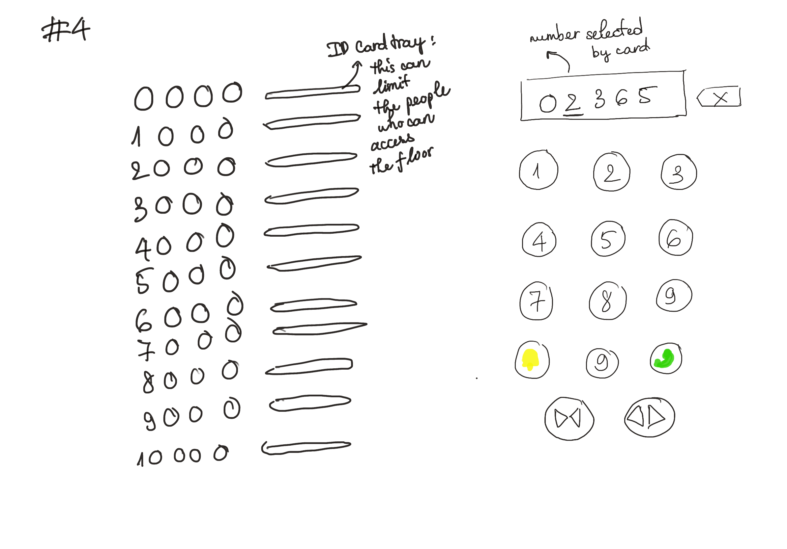
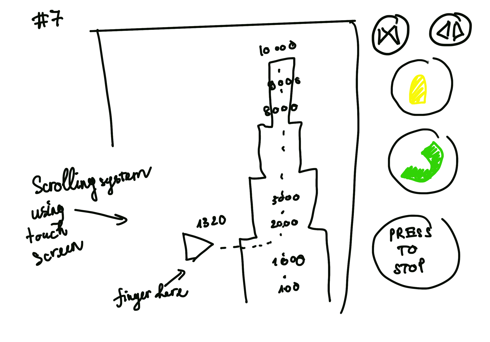
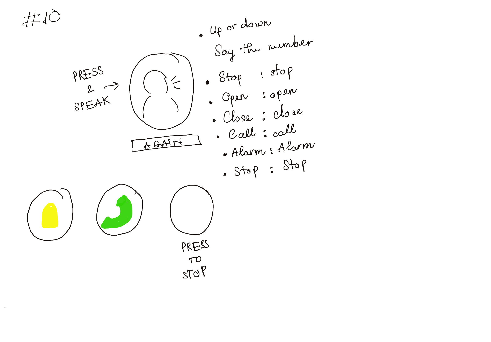

## 10,000-floor elevator's control interfaces

This is just a project for me to try out UX/UI Design. I want to design an interface for the elevator that can deliver information about the floor, the speed, and the status of the elevator. 

### Favourite Design:
My favorite idea is my number 10: the voice activation elevator. I like it because it very minimal and requires only 5 buttons. You give orders for the elevator by holding one button and say the floor number, stop, open, close, call, alarm.

Even though all the orders can be voice-activated, I still have physical buttons that give out some exactly the same with voice. Those are alarm, call, and stop. Because of safety reasons, I think of the scenario when there are dangers in the elevator which cause panic to the people inside. This can affect their voice's volume and tone - or maybe there would be screaming in the elevator. All of that can cause flaws to the voice recognization systems. Therefore, I kept all the important buttons for safety old-school.

### Reflection: 

For the first two ideas, it was easy because I came up with the interface that tackles the problems directly. I focused on making an interface that can help the user know the floor and the speed they are going on the screen; touch screen number to control the floor. I chose the touch screen because I want to make the user feel this elevator is more technologically advanced - as it can go up to 10,000 floors. I continued to change the shape of the buttons and information on the screen let you know your speed and location for varieties in the following ideas. This is the methods of changing the way that the elevator delivers information to the user

Next, I tried to change the way that the users deliver information to the elevator. For example, the users will give out the floor they want to go through their voice, through writing on a screen using a pen, through scrolling, through cards.

After that, it got harder to come up with new ideas, so I went back to changing the shape and the design of the buttons. For example, instead of having the number like a normal number-enter interface on the phone, I reorganized the buttons in a circle.

The elements that stay the same for every interface that I made was the "PRESS TO STOP" button. It remains a physical button throughout 10 ideas because I think safety is the most important thing so it must be the most visible button in the interface.

I am surprised with my creativity after doing this project. I am hoping that I can improve this project visually with better sketches in the future
