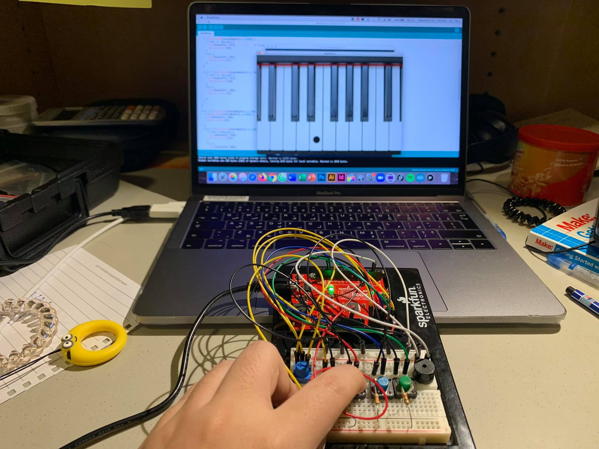

## Concepts:
This is my project after two weeks of learning Arduino and Processing

I use the communications between Processing and Arduino to improve my piano. In this new version, when I play any note with Arduino, there will be note played on the laptop screen. 

When you play Do, you will se the note Do played on the screen. 

## Details: 
My circuit contain 4 push buttons, 1 potentiometer, and 1 buzzer. 
I have organized the button direction suitable for the piano's hand position. 

### Input: 
- Button 1: Do 
- Button 1 & potentiometer: Do#
- Button 1 & 2: Re
- Button 1 & 2 & potentiometer: Re#
- Button 2: Mi 
- Button 2 & 3: Fa
- Button 2 & 3 & potentiometer: Fa#
- Button 3: Sol
- Button 3 & potentiometer: Sol#
- Button 3 & 4: La
- Button 3 & 4 & potentiometer: La
- Button 4: Si 
- Button 4 & potentionmeter: Si# = Do 

### Output:
- Buzzer
- Screen 

## Media: 

Video: https://www.youtube.com/watch?v=0U2wVNKgt1Y

Keyboard pressed when a note is played on Arduino: 

White note played:

Black note played:

Circuit is the same as before: 

Schematic: 

## Dificulties:
I encountered difficulties in drawing the circles when I pressed the button. My idea is whenever I play a note on Arduino, there will be a circle appear on the piano keyboard on the scree. I had to figure out how to make the circle disappear when the note is not played. My solution is creating boolean (explained in the code file). I apply this same concept on my final.
