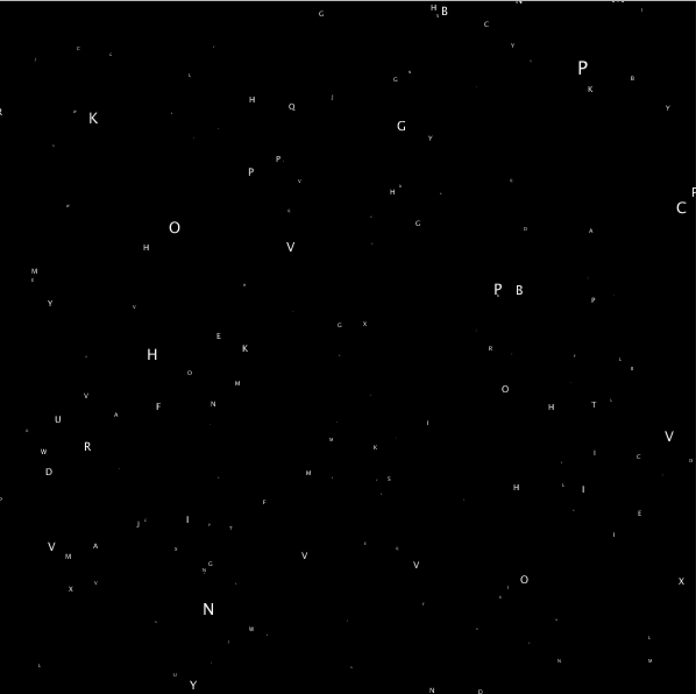

 ### Generative Text

I came across a tutorial by Dan Shiffman about drawing a starfield with Processing and I really liked it. However, I wanted to make it more "texty" by replacing the stars with my name first but I ended up making it a little more challenging by turning the stars into random character. 

Youtube Instruction Link: https://www.youtube.com/watch?v=17WoOqgXsRM

#### Challenge: 

I needed to find the way to make an array for the alphabet because it will takes a lot of time draw 26 different characters manually. Although I know to solve this with array, I did not know how to make characters become numbers so that I can put it in the array. At the end, I managed to know about the ASCII code and used it. 
